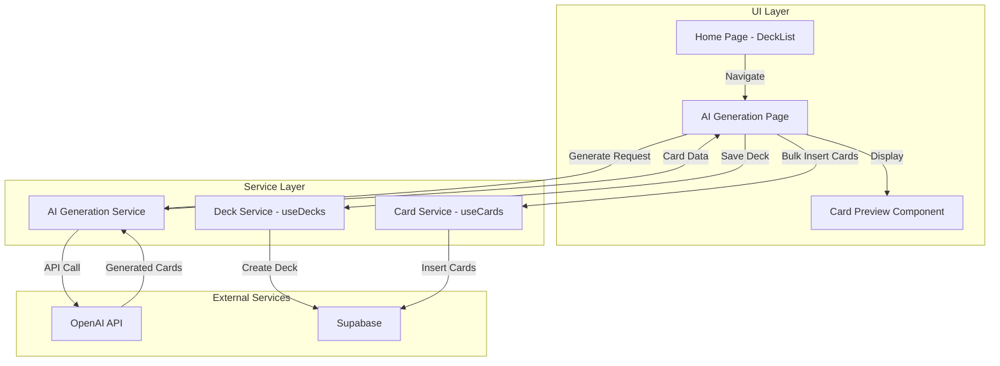

# Design Document: AI Deck Generation

## Overview

This design document describes the architecture and implementation approach for the AI-powered deck/card generation feature in Flash Snap. The feature allows users to generate flashcard decks using AI prompts, leveraging OpenAI's GPT-4o-mini model to create educational content.

The feature follows the existing patterns in Flash Snap:

- Service-oriented architecture for AI communication
- React Query hooks for data management
- i18n support for all user-facing text
- TailwindCSS for styling

## Architecture



### Component Flow

1. User clicks "Create With AI" card on home page
2. Navigation to `/ai-generate` route
3. User selects preset or enters custom prompt
4. AI Generation Service calls OpenAI API
5. Generated cards displayed in preview
6. User saves deck → creates deck + bulk inserts cards to Supabase
7. Navigation to new deck view

## Components and Interfaces

### New Components

#### 1. AIGeneratePage (`pages/AIGeneratePage.tsx`)

Main page component for AI generation feature.

```typescript
interface AIGeneratePageState {
  prompt: string;
  isGenerating: boolean;
  generatedCards: GeneratedCard[];
  generatedDeckName: string; // AI-generated deck name
  generatedDeckType: "language" | "knowledge"; // AI-determined type
  error: string | null;
  isSaving: boolean;
}

interface GeneratedCard {
  front: string;
  back: string;
}
```

**Responsibilities:**

- Render preset prompt pills
- Handle custom prompt input
- Trigger AI generation
- Display card preview with AI-generated deck name
- Allow user to edit deck name before saving
- Handle deck saving flow

#### 2. PromptPills (`components/PromptPills.tsx`)

Reusable component for displaying preset prompt options.

```typescript
interface PromptPillsProps {
  presets: PresetPrompt[];
  onSelect: (prompt: string) => void;
  selectedPrompt: string | null;
}

interface PresetPrompt {
  id: string;
  label: string;
  prompt: string;
  category: "language" | "knowledge";
}
```

#### 3. CardPreviewList (`components/CardPreviewList.tsx`)

Scrollable container for displaying generated card previews.

```typescript
interface CardPreviewListProps {
  cards: GeneratedCard[];
  isLoading: boolean;
}
```

#### 4. CreateWithAICard (`components/CreateWithAICard.tsx`)

Prominent card component for home page entry point.

```typescript
interface CreateWithAICardProps {
  onClick: () => void;
}
```

### Modified Components

#### DeckList.tsx

- Add `CreateWithAICard` component to the deck list area
- Position prominently above or alongside existing deck actions

### New Service

#### aiGenerationService.ts

```typescript
interface AIGenerationService {
  generateDeck(prompt: string): Promise<GenerationResult>;
  isConfigured(): boolean;
}

interface GenerationResult {
  deckName: string; // AI-generated deck name
  deckType: "language" | "knowledge"; // AI-determined type
  cards: GeneratedCard[];
}

interface OpenAIMessage {
  role: "system" | "user" | "assistant";
  content: string;
}
```

**Implementation Details:**

- Uses OpenAI SDK with `gpt-4o-mini` model
- System prompt instructs AI to generate flashcards in JSON format
- AI generates deck name and type based on the topic
- Enforces 50 card maximum in the prompt
- Parses JSON response to extract deck name, type, and card data
- Handles API errors gracefully

### Route Configuration

Add new route to `routes.tsx`:

```typescript
{
  path: '/ai-generate',
  element: <AIGeneratePage />
}
```

## Data Models

### GeneratedCard (Temporary/Preview)

```typescript
interface GeneratedCard {
  front: string; // Question or term
  back: string; // Answer or definition
}
```

This is a simplified card structure used during preview. When saved, cards are converted to the full `Card` type with additional fields initialized by Supabase.

### Preset Prompts Configuration

```typescript
const PRESET_PROMPTS: PresetPrompt[] = [
  {
    id: "js-programming",
    label: "Learn JavaScript Programming",
    prompt:
      "Generate 30 flashcards about JavaScript programming fundamentals including variables, functions, arrays, objects, and ES6 features",
    category: "knowledge",
  },
  {
    id: "english-travel",
    label: "Learn English for Travel",
    prompt:
      "Generate 30 flashcards with essential English phrases and vocabulary for traveling, including airport, hotel, restaurant, and directions",
    category: "language",
  },
  {
    id: "english-interviews",
    label: "Learn English for Interviews",
    prompt:
      "Generate 30 flashcards with professional English vocabulary and phrases commonly used in job interviews",
    category: "language",
  },
  {
    id: "spanish-basics",
    label: "Learn Spanish Basics",
    prompt:
      "Generate 30 flashcards with basic Spanish vocabulary and common phrases for beginners",
    category: "language",
  },
  {
    id: "python-programming",
    label: "Learn Python Programming",
    prompt:
      "Generate 30 flashcards about Python programming including syntax, data structures, and common patterns",
    category: "knowledge",
  },
];
```

### OpenAI Request/Response

```typescript
// Request structure
interface OpenAIRequest {
  model: "gpt-4o-mini";
  messages: OpenAIMessage[];
  temperature: number;
  max_tokens: number;
  response_format: { type: "json_object" };
}

// Expected response structure (parsed from JSON)
interface OpenAIGenerationResponse {
  deckName: string; // AI-generated deck name based on the topic
  deckType: "language" | "knowledge"; // AI-determined deck type
  cards: Array<{
    front: string;
    back: string;
  }>;
}
```

### Environment Configuration

```
# .env
VITE_OPENAI_API_KEY=sk-...
```

## Correctness Properties

_A property is a characteristic or behavior that should hold true across all valid executions of a system—essentially, a formal statement about what the system should do. Properties serve as the bridge between human-readable specifications and machine-verifiable correctness guarantees._

Based on the acceptance criteria analysis, the following properties should hold for the AI deck generation feature:

### Property 1: Generate Button Enablement

_For any_ input string with length >= 3 characters, the generate button SHALL be enabled. _For any_ input string with length < 3 characters, the generate button SHALL be disabled.

**Validates: Requirements 3.2**

### Property 2: Whitespace Input Rejection

_For any_ string composed entirely of whitespace characters (spaces, tabs, newlines), the system SHALL prevent generation and the prompt SHALL be considered invalid.

**Validates: Requirements 3.3**

### Property 3: Generated Card Structure

_For any_ successful API response from the AI generation service, every parsed card SHALL have both a non-empty `front` field and a non-empty `back` field.

**Validates: Requirements 4.3**

### Property 4: Generated Deck Metadata

_For any_ successful API response from the AI generation service, the response SHALL include a non-empty `deckName` string and a valid `deckType` value ("language" or "knowledge").

**Validates: Requirements 4.4, 4.5**

### Property 5: Maximum Card Limit

_For any_ generation request, the number of cards returned SHALL never exceed 50, regardless of what the user requests in their prompt.

**Validates: Requirements 4.6, 4.7**

### Property 6: Card Preview Completeness

_For any_ generated card displayed in the preview list, both the front content and back content SHALL be visible to the user.

**Validates: Requirements 5.2**

### Property 7: Card Count Accuracy

_For any_ set of generated cards, the displayed count SHALL equal the actual number of cards in the generated array.

**Validates: Requirements 5.3**

### Property 8: Bulk Insert Completeness

_For any_ save operation with N generated cards, exactly N cards SHALL be inserted into Supabase, and all cards SHALL be associated with the newly created deck.

**Validates: Requirements 6.3**

## Error Handling

### API Key Missing

When `VITE_OPENAI_API_KEY` is not set or empty:

- Display a configuration error message on the AI generation page
- Disable the generate button
- Provide guidance on how to configure the API key

### OpenAI API Errors

| Error Type              | User Message                                               | Recovery Action    |
| ----------------------- | ---------------------------------------------------------- | ------------------ |
| Rate limit (429)        | "Too many requests. Please wait a moment and try again."   | Show retry button  |
| Invalid API key (401)   | "API configuration error. Please check your settings."     | Disable generation |
| Server error (5xx)      | "AI service temporarily unavailable. Please try again."    | Show retry button  |
| Network error           | "Connection error. Please check your internet connection." | Show retry button  |
| Invalid response format | "Failed to parse AI response. Please try again."           | Show retry button  |

### Supabase Save Errors

| Error Type     | User Message                                         | Recovery Action   |
| -------------- | ---------------------------------------------------- | ----------------- |
| Network error  | "Failed to save deck. Please check your connection." | Show retry button |
| Auth error     | "Session expired. Please log in again."              | Redirect to login |
| Database error | "Failed to save deck. Please try again."             | Show retry button |

### Input Validation Errors

- Empty prompt: "Please enter a topic for your flashcards"
- Whitespace-only prompt: "Please enter a valid topic"
- Prompt too short (< 3 chars): Button remains disabled (no error message needed)

## Testing Strategy

### Unit Tests

Unit tests should cover specific examples and edge cases:

1. **Input Validation**
   - Empty string input
   - Single character input
   - Whitespace-only input variations (spaces, tabs, mixed)
   - Exactly 3 character input (boundary)
   - Valid prompt input

2. **Card Parsing**
   - Valid JSON response parsing
   - Malformed JSON handling
   - Missing fields handling
   - Empty cards array handling

3. **Component Rendering**
   - Empty state rendering
   - Loading state rendering
   - Error state rendering
   - Card preview rendering

4. **Navigation**
   - Route to AI generation page
   - Route to deck view after save

### Property-Based Tests

Property-based tests should use a library like `fast-check` to verify universal properties:

**Configuration:**

- Minimum 100 iterations per property test
- Each test tagged with: **Feature: ai-deck-generation, Property {number}: {property_text}**

1. **Property 1 Test: Generate Button Enablement**
   - Generate random strings of varying lengths
   - Verify button state matches length >= 3 rule

2. **Property 2 Test: Whitespace Input Rejection**
   - Generate strings composed only of whitespace characters
   - Verify all are rejected as invalid

3. **Property 3 Test: Generated Card Structure**
   - Generate mock API responses with various card structures
   - Verify parsing extracts front and back fields correctly

4. **Property 4 Test: Generated Deck Metadata**
   - Generate mock API responses with various deck metadata
   - Verify deckName is non-empty and deckType is valid

5. **Property 5 Test: Maximum Card Limit**
   - Generate responses with varying card counts (0-100)
   - Verify output never exceeds 50 cards

6. **Property 6 Test: Card Preview Completeness**
   - Generate cards with various front/back content
   - Verify both are rendered in preview

7. **Property 7 Test: Card Count Accuracy**
   - Generate arrays of varying lengths
   - Verify displayed count matches array length

8. **Property 8 Test: Bulk Insert Completeness**
   - Generate card arrays of varying sizes
   - Verify all cards are included in insert operation

### Integration Tests

1. **End-to-end generation flow**
   - Mock OpenAI API
   - Verify complete flow from prompt to preview

2. **Save deck flow**
   - Mock Supabase
   - Verify deck creation and card insertion

### Test File Structure

```
packages/desktop/tests/
├── unit/
│   ├── aiGenerationService.test.ts
│   ├── AIGeneratePage.test.tsx
│   └── PromptPills.test.tsx
├── property/
│   └── aiGeneration.property.test.ts
└── integration/
    └── aiGenerationFlow.test.ts
```
