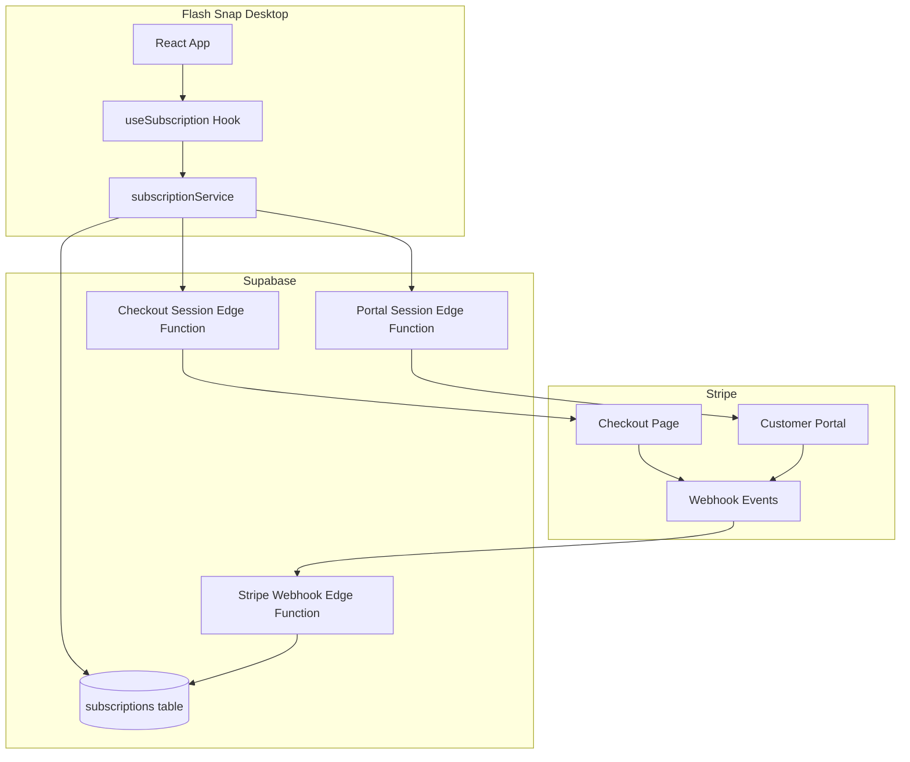

# Design Document: Stripe Subscriptions

## Overview

This design describes the integration of Stripe subscription management into Flash Snap. The architecture follows a simple, reliable pattern where:

1. **Supabase** stores subscription state linked to users
2. **Stripe** handles all payment processing and subscription management
3. **Supabase Edge Functions** process Stripe webhooks to sync state
4. **Desktop App** displays status and links to Stripe's Customer Portal

The design prioritizes reliability over complexity - subscription management happens entirely through Stripe's hosted pages, while the app focuses on reading and displaying subscription state.

## Architecture



## Components and Interfaces

### 1. Supabase Schema

#### subscriptions table

```sql
CREATE TABLE subscriptions (
  id UUID PRIMARY KEY DEFAULT gen_random_uuid(),
  user_id UUID NOT NULL REFERENCES auth.users(id) ON DELETE CASCADE,
  stripe_customer_id TEXT,
  stripe_subscription_id TEXT,
  status TEXT NOT NULL DEFAULT 'free' CHECK (status IN ('free', 'active', 'canceled', 'past_due')),
  price_id TEXT,
  current_period_start TIMESTAMPTZ,
  current_period_end TIMESTAMPTZ,
  cancel_at_period_end BOOLEAN DEFAULT FALSE,
  created_at TIMESTAMPTZ DEFAULT NOW(),
  updated_at TIMESTAMPTZ DEFAULT NOW(),
  UNIQUE(user_id)
);

-- Index for quick lookups
CREATE INDEX idx_subscriptions_user_id ON subscriptions(user_id);
CREATE INDEX idx_subscriptions_stripe_customer_id ON subscriptions(stripe_customer_id);

-- RLS policies
ALTER TABLE subscriptions ENABLE ROW LEVEL SECURITY;

CREATE POLICY "Users can read own subscription"
  ON subscriptions FOR SELECT
  USING (auth.uid() = user_id);

-- Only Edge Functions (service role) can insert/update
CREATE POLICY "Service role can manage subscriptions"
  ON subscriptions FOR ALL
  USING (auth.role() = 'service_role');
```

#### Trigger for new users

This trigger automatically creates a subscription record when a user signs up - no changes needed to the registration form.

```sql
CREATE OR REPLACE FUNCTION create_subscription_for_new_user()
RETURNS TRIGGER AS $$
BEGIN
  INSERT INTO subscriptions (user_id, status)
  VALUES (NEW.id, 'free');
  RETURN NEW;
END;
$$ LANGUAGE plpgsql SECURITY DEFINER;

CREATE TRIGGER on_auth_user_created
  AFTER INSERT ON auth.users
  FOR EACH ROW
  EXECUTE FUNCTION create_subscription_for_new_user();
```

### 2. Edge Functions

#### stripe-webhook (Webhook Handler)

Handles incoming Stripe webhook events and updates subscription state.

```typescript
// supabase/functions/stripe-webhook/index.ts
interface WebhookPayload {
  type: string;
  data: {
    object: Stripe.Subscription | Stripe.Checkout.Session | Stripe.Invoice;
  };
}

// Supported events:
// - checkout.session.completed
// - customer.subscription.updated
// - customer.subscription.deleted
// - invoice.payment_failed
```

#### create-checkout-session

Creates a Stripe Checkout Session for upgrading to premium.

```typescript
// supabase/functions/create-checkout-session/index.ts
interface CreateCheckoutRequest {
  priceId: string;
  userId: string;
  userEmail: string;
}

interface CreateCheckoutResponse {
  url: string;
}
```

#### create-portal-session

Creates a Stripe Customer Portal session for subscription management.

```typescript
// supabase/functions/create-portal-session/index.ts
interface CreatePortalRequest {
  customerId: string;
}

interface CreatePortalResponse {
  url: string;
}
```

### 3. Frontend Services

#### subscriptionService.ts

```typescript
// src/renderer/src/services/subscriptionService.ts

export interface Subscription {
  id: string;
  user_id: string;
  stripe_customer_id: string | null;
  stripe_subscription_id: string | null;
  status: "free" | "active" | "canceled" | "past_due";
  price_id: string | null;
  current_period_start: string | null;
  current_period_end: string | null;
  cancel_at_period_end: boolean;
  created_at: string;
  updated_at: string;
}

export async function getSubscription(
  userId: string,
): Promise<Subscription | null>;
export async function createCheckoutSession(priceId: string): Promise<string>;
export async function createPortalSession(): Promise<string>;
```

#### useSubscription.ts Hook

```typescript
// src/renderer/src/hooks/useSubscription.ts

interface UseSubscriptionReturn {
  subscription: Subscription | null;
  isLoading: boolean;
  isPremium: boolean;
  canCreateDeck: (currentDeckCount: number) => boolean; // Free users limited to 1 deck
  openCheckout: () => Promise<void>;
  openPortal: () => Promise<void>;
  refetch: () => void;
}

export function useSubscription(): UseSubscriptionReturn;
```

### 4. UI Components

#### SubscriptionStatus Component

Displays current subscription status in the Settings page.

```typescript
// src/renderer/src/components/SubscriptionStatus.tsx

interface SubscriptionStatusProps {
  subscription: Subscription | null;
  onUpgrade: () => void;
  onManage: () => void;
}
```

## Data Models

### Subscription Type

```typescript
// src/renderer/src/types/index.ts

export type SubscriptionStatus = "free" | "active" | "canceled" | "past_due";

export interface Subscription {
  id: string;
  user_id: string;
  stripe_customer_id: string | null;
  stripe_subscription_id: string | null;
  status: SubscriptionStatus;
  price_id: string | null;
  current_period_start: string | null;
  current_period_end: string | null;
  cancel_at_period_end: boolean;
  created_at: string;
  updated_at: string;
}
```

### Stripe Configuration

Environment variables required:

```bash
# .env
STRIPE_SECRET_KEY=sk_...
STRIPE_WEBHOOK_SECRET=whsec_...
STRIPE_PRICE_ID=price_...
```

## Correctness Properties

_A property is a characteristic or behavior that should hold true across all valid executions of a system—essentially, a formal statement about what the system should do. Properties serve as the bridge between human-readable specifications and machine-verifiable correctness guarantees._

### Property 1: New user subscription creation

_For any_ newly created user in the auth.users table, there SHALL exist a corresponding subscription record with status 'free' in the subscriptions table.

**Validates: Requirements 1.2**

### Property 2: User-subscription uniqueness

_For any_ user_id, there SHALL be at most one subscription record in the subscriptions table.

**Validates: Requirements 1.3**

### Property 3: Updated timestamp on modification

_For any_ subscription record, when any field is updated, the updated_at timestamp SHALL be greater than or equal to its previous value.

**Validates: Requirements 1.4**

### Property 4: Checkout completion activates subscription

_For any_ valid `checkout.session.completed` webhook event with user metadata, processing the event SHALL result in the corresponding subscription having status 'active' and non-null stripe_customer_id and stripe_subscription_id.

**Validates: Requirements 2.1**

### Property 5: Subscription update syncs all fields

_For any_ valid `customer.subscription.updated` webhook event, processing the event SHALL result in the subscription record having status, current_period_start, current_period_end, and cancel_at_period_end matching the event data.

**Validates: Requirements 2.2**

### Property 6: Subscription deletion sets canceled status

_For any_ valid `customer.subscription.deleted` webhook event, processing the event SHALL result in the corresponding subscription having status 'canceled'.

**Validates: Requirements 2.3**

### Property 7: Payment failure sets past_due status

_For any_ valid `invoice.payment_failed` webhook event for a subscription invoice, processing the event SHALL result in the corresponding subscription having status 'past_due'.

**Validates: Requirements 2.4**

### Property 8: Invalid signature rejection

_For any_ webhook request with an invalid or missing Stripe signature, the webhook handler SHALL return a 400 status code and NOT modify any subscription records.

**Validates: Requirements 2.5**

### Property 9: Webhook idempotence

_For any_ valid webhook event, processing the same event multiple times SHALL result in the same final subscription state as processing it once.

**Validates: Requirements 2.6**

### Property 10: Checkout session contains user metadata

_For any_ checkout session created by the Subscription_Service, the session SHALL contain the user's email and user_id in its metadata.

**Validates: Requirements 3.1**

### Property 11: Portal session requires valid customer

_For any_ portal session creation request, the request SHALL only succeed if the user has a valid stripe_customer_id in their subscription record.

**Validates: Requirements 4.1**

### Property 12: Subscription caching reduces queries

_For any_ sequence of N subscription status reads within the cache TTL, the number of database queries SHALL be less than N.

**Validates: Requirements 5.3**

### Property 13: Active subscription shows renewal date

_For any_ subscription with status 'active', the UI component SHALL display the current_period_end date.

**Validates: Requirements 6.3**

### Property 14: Canceling subscription shows notice

_For any_ subscription with cancel_at_period_end=true, the UI component SHALL display a cancellation notice including the current_period_end date.

**Validates: Requirements 6.4**

### Property 15: Free users see upgrade option

_For any_ subscription with status 'free', the UI component SHALL display an upgrade button.

**Validates: Requirements 6.5**

## Error Handling

### Webhook Errors

| Error Condition       | Response           | Recovery                                |
| --------------------- | ------------------ | --------------------------------------- |
| Invalid signature     | 400 Bad Request    | Log attempt, no retry needed            |
| Missing user metadata | 400 Bad Request    | Log error, manual investigation         |
| Database error        | 500 Internal Error | Stripe will retry automatically         |
| Unknown event type    | 200 OK             | Ignore silently (forward compatibility) |

### Checkout/Portal Errors

| Error Condition                  | User Experience    | Technical Response                      |
| -------------------------------- | ------------------ | --------------------------------------- |
| No stripe_customer_id for portal | Show error message | Return error, prompt to contact support |
| Stripe API error                 | Show generic error | Log error, return 500                   |
| Network timeout                  | Show retry option  | Return timeout error                    |

### Frontend Error Handling

```typescript
// Error states in useSubscription hook
interface SubscriptionError {
  code: "FETCH_ERROR" | "CHECKOUT_ERROR" | "PORTAL_ERROR";
  message: string;
}
```

## Testing Strategy

### Unit Tests

Unit tests focus on specific examples and edge cases:

1. **subscriptionService.ts**
   - Test getSubscription returns correct data shape
   - Test createCheckoutSession calls Edge Function correctly
   - Test createPortalSession handles missing customer ID

2. **useSubscription hook**
   - Test initial loading state
   - Test successful data fetch
   - Test error handling
   - Test isPremium computed property for each status

3. **SubscriptionStatus component**
   - Test renders upgrade button for free users
   - Test renders manage button for active users
   - Test renders cancellation notice when cancel_at_period_end is true
   - Test renders renewal date for active subscriptions

### Property-Based Tests

Property tests validate universal properties across generated inputs. Use a property-based testing library (e.g., fast-check for TypeScript).

Each property test MUST:

- Run minimum 100 iterations
- Reference the design document property
- Tag format: **Feature: stripe-subscriptions, Property {number}: {property_text}**

**Webhook Handler Properties:**

- Property 4: Generate random valid checkout.session.completed events, verify subscription activation
- Property 5: Generate random subscription.updated events, verify field synchronization
- Property 6: Generate random subscription.deleted events, verify status change
- Property 7: Generate random invoice.payment_failed events, verify status change
- Property 8: Generate events with corrupted signatures, verify rejection
- Property 9: Send duplicate events, verify idempotent behavior

**Database Properties:**

- Property 1: Create random users, verify subscription record creation
- Property 2: Attempt duplicate subscription inserts, verify constraint enforcement
- Property 3: Update subscriptions, verify timestamp updates

**UI Properties:**

- Property 13: Generate active subscriptions, verify renewal date display
- Property 14: Generate canceling subscriptions, verify notice display
- Property 15: Generate free subscriptions, verify upgrade button display

### Integration Tests

1. **End-to-end checkout flow** (manual/staging)
   - Create checkout session
   - Complete payment in Stripe test mode
   - Verify webhook updates subscription
   - Verify UI reflects new status

2. **Portal flow** (manual/staging)
   - Open portal for active subscriber
   - Cancel subscription in portal
   - Verify webhook updates subscription
   - Verify UI shows cancellation notice

## Stripe Configuration Guide

### 1. Create Products and Prices

In Stripe Dashboard → Products:

**Free Plan (optional - for tracking):**

1. Add Product → Name: "Flash Snap Free"
2. Add a price: $0.00/month (or skip if you don't need to track free users in Stripe)

> **Free Tier Limitation:** Free users can only create one deck. This is enforced client-side in the desktop app for simplicity.

**Premium Plan:**

1. Add Product → Name: "Flash Snap Premium"
2. Add a recurring price (e.g., $9.99/month)
3. Copy the `price_id` (starts with `price_`)

**Your Stripe IDs:**

- Free Product: `prod_TqBA6FhjuUGFGa`
- Premium Product: `prod_TqB3LpiluEuown`
- Premium Price: `price_1SsUhmE13c2k8XKrUecLh4J7`

### 2. Configure Customer Portal

In Stripe Dashboard → Settings → Billing → Customer Portal:

1. Enable the customer portal
2. Configure allowed actions:
   - Update payment methods: ✓
   - Cancel subscriptions: ✓
   - View invoices: ✓
3. Set return URL: `flash-snap://subscription-callback`

### 3. Set Up Webhooks

In Stripe Dashboard → Developers → Webhooks:

1. Add endpoint: `https://<your-supabase-project>.supabase.co/functions/v1/stripe-webhook`
2. Select events:
   - `checkout.session.completed`
   - `customer.subscription.updated`
   - `customer.subscription.deleted`
   - `invoice.payment_failed`
3. Copy the webhook signing secret (starts with `whsec_`)

### 4. Environment Variables

Add to Supabase Edge Function secrets:

```bash
supabase secrets set STRIPE_SECRET_KEY=sk_...
supabase secrets set STRIPE_WEBHOOK_SECRET=whsec_...
supabase secrets set STRIPE_PRICE_ID=price_...
```

Add to desktop app `.env`:

```bash
VITE_STRIPE_PRICE_ID=price_...
```
